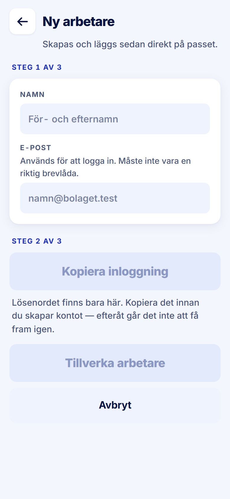

ROLE: admin

ENTRY: Chose '+ Ny arbetare…' in the 'Vem?' select on Snabb Pass

SCREEN: Snabb Pass · Ny arbetare

MISSION: Create the off-roster person and put them straight on the pass.

FRICTION: none — restyle only

KEEP: Numbered steps, the disabled-until-copied pattern the handoff documents, the line explaining the password exists only here.

ADJUST: none — restyle only

