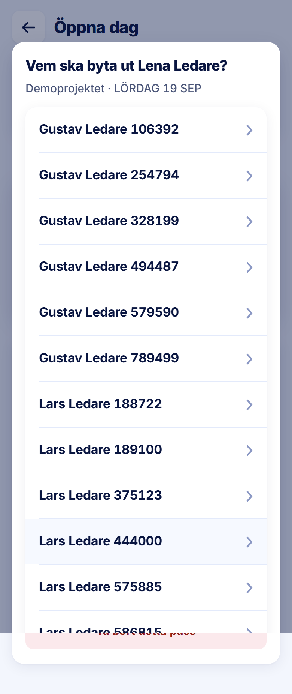

ROLE: admin

ENTRY: Pressed 'Avboka Pass — Lena Ledare' on Öppna dag

SCREEN: Vem ska byta ut Lena Ledare?

MISSION: Choose who takes the leader's day over.

FRICTION: The list runs out of the dialog: its last row collides with the page's 'Ta bort detta pass' button showing through at the bottom edge, and there is no visible end to the list or way out on screen.

KEEP: Title naming the person, project · day subtitle, 60px rows with chevrons.

ADJUST: Resize: cap the dialog at the viewport height (16px gutters) and scroll the list inside it, so the card's own edge — and anything below the list — stays on screen.

