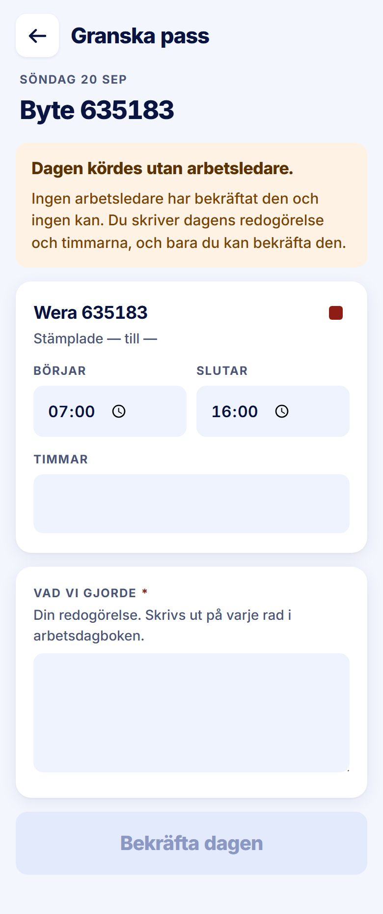

ROLE: admin

ENTRY: Pressed a day on Bekräftelser · Att bekräfta

SCREEN: Granska pass (a flagged day)

MISSION: Supply the day's account and hours for a day no leader could confirm, and close it.

FRICTION: The small red square top-right of the worker card is a tappable 'ej stämplad' control drawn in colour only — no word, and under the 44px tap minimum. 'Stämplade — till —' prints dashes. There is no finality notice before 'Bekräfta dagen' (handoff §3.3 requires one on the admin review screen).

KEEP: The amber 'Dagen kördes utan arbetsledare.' panel first, Timmar field, Vad vi gjorde with the red required marker.

ADJUST: Resize the ej-stämplad mark to a 44px target and give it the handoff's status-tag form (word + warn colours, 'Ej stämplad'). (The missing finality notice is new text, raised in the report.)

NOTED (decided 2026-09-28, not fixed in this pass): Out of scope for this pass. No finality notice before Bekräfta dagen (handoff §3.3).
