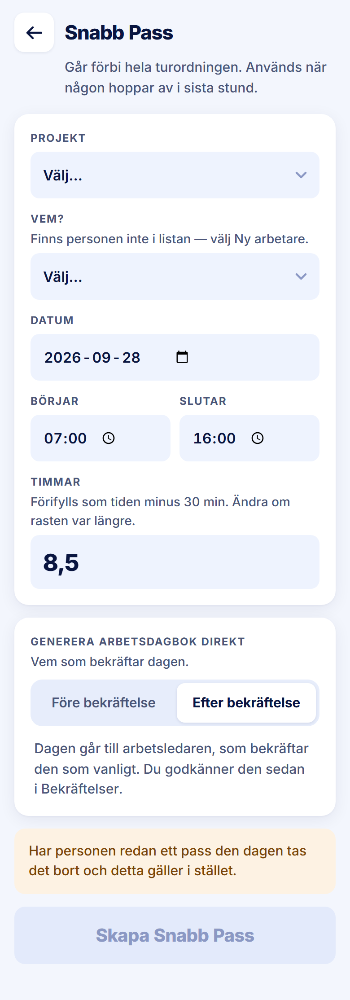

ROLE: admin

ENTRY: Pressed 'Efter bekräftelse' on Snabb Pass

SCREEN: Snabb Pass · Efter bekräftelse

MISSION: Place the person and send the day through the arbetsledare and stage 2 as usual.

FRICTION: Same naming and amber-notice issue as the Före state.

KEEP: Vad vi gjorde disappears in this mode, so the form only asks what this route needs; the primary relabels to 'Skapa Snabb Pass'.

ADJUST: none — restyle only. The friction is not a layout change (same copy question as the Före state), so it is raised in the Phase 2 report for your decision rather than adjusted here.

NOTED (decided 2026-09-28, not fixed in this pass): Out of date. Same amber notice as the Före state.
