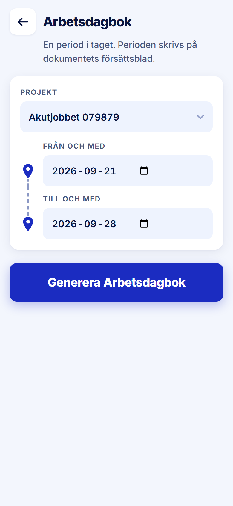

ROLE: admin

ENTRY: Pressed a project row, then 'Generera Arbetsdagbok'

SCREEN: Arbetsdagbok · välj period

MISSION: Choose the period to document and generate (tour step 9: 'Välj period och tryck Generera Arbetsdagbok').

FRICTION: none — restyle only

KEEP: Project preselected from the row, the from/to rail, one primary action.

ADJUST: none — restyle only

