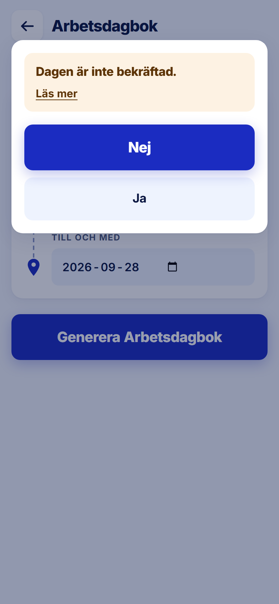

ROLE: admin

ENTRY: Pressed 'Generera Arbetsdagbok' on a period with unconfirmed days

SCREEN: Bristsurvey · varning

MISSION: Decide, knowingly, whether to fill the period's gaps yourself instead of the leader.

FRICTION: The buttons are 'Nej' and 'Ja' but the question they answer ('…vill du gå vidare?') is hidden behind 'Läs mer'. The visible text is only 'Dagen är inte bekräftad.' — a statement, not a question — so the admin answers yes/no to something they cannot see. This is the one screen that lets unconfirmed hours into the document.

KEEP: Amber panel, Nej as the default-looking primary (the outcome the screen prefers), Ja as secondary, dialog over the dimmed form.

ADJUST: Remove the Läs mer toggle and show the explanation paragraph always, so the question sits directly above Nej/Ja.

