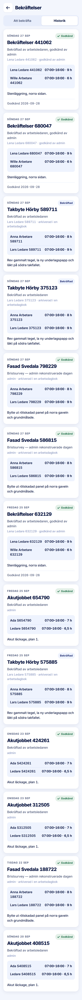

ROLE: admin

ENTRY: Pressed 'Historik' on Bekräftelser

SCREEN: Bekräftelser · Historik

MISSION: See where each closed day sits in the chain and what was filed.

FRICTION: The chain is said twice ('Bekräftad av arbetsledaren, godkänd av admin' then 'Lena Ledare · godkänd av admin'), and the second line is set in #8b98c4, which the handoff forbids for text. Long worker names wrap under the time column.

KEEP: Green 'Godkänd' tag, project at 22/800, per-person panel with span and hours, the note, the approval date.

ADJUST: Second chain line to #4a5578 (or removed, since the first line says it). Per-person rows: name truncates on one line, span · hours right-aligned.

