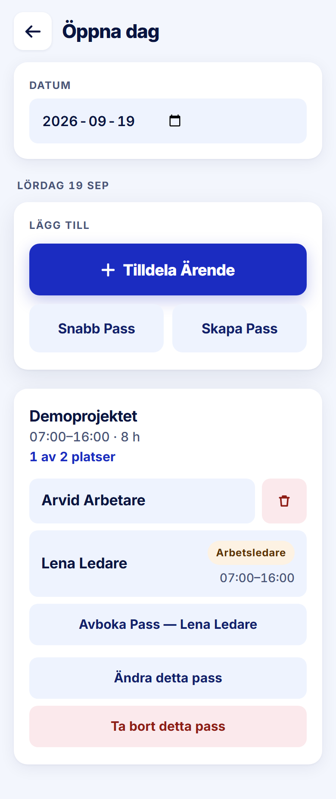

ROLE: admin

ENTRY: Pressed a day cell with project bars on Skiftkalender

SCREEN: Öppna dag

MISSION: See who works this day and fix it — remove someone, change the pass, replace the leader.

FRICTION: The day's content (who is on which pass) is below the fold; above it sits a 'Lägg till' card whose accent 'Tilldela Ärende' is the screen's loudest element, although the admin came from a calendar of shifts to look at shifts. The trash icon beside a worker cancels the booking on the first tap with no confirmation.

KEEP: Date picker, weekday kicker, per-pass card with 'N av M platser', leader row with warn tag, destructive action last and tinted.

ADJUST: Reorder: pass cards directly under the day kicker; the 'Lägg till' card after them, with Tilldela Ärende reduced to the secondary (#eef3fe) weight so the pass card is what leads. (The no-confirm trash is behaviour, raised in the report.)

NOTED (decided 2026-09-28, not fixed in this pass): Bug. The trash icon beside a worker cancels the booking on the first tap, with no confirmation.
