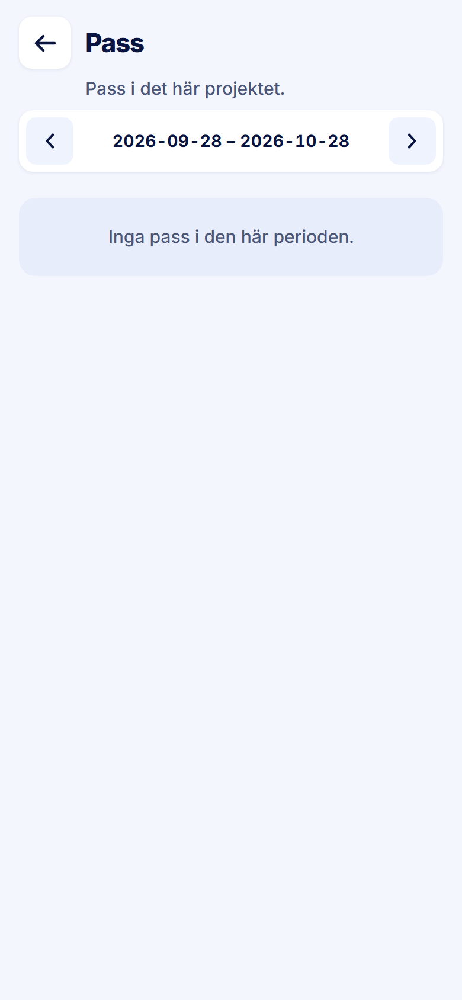

ROLE: admin

ENTRY: Pressed a project row, then 'Kolla Pass'

SCREEN: Projektets pass

MISSION: See this project's shifts over the coming month and open a day.

FRICTION: When the period is empty the title falls back to 'Pass', so the screen no longer names the project the admin just chose. The window starts today, so a project whose work is past opens empty.

KEEP: Period pager, empty state, day groups with count.

ADJUST: none — restyle only. The friction is not a layout change (the title and the default window are content logic), so it is raised in the Phase 2 report for your decision rather than adjusted here.

