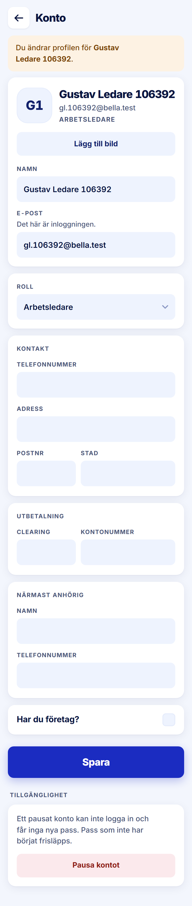

ROLE: admin

ENTRY: Pressed an account row on Alla Konton

SCREEN: Konto (another person)

MISSION: Correct someone's details or role, or pause the account.

FRICTION: Card titles stack on field labels in the same style.

KEEP: Amber 'Du ändrar profilen för …' banner first, Pausa kontot as a tint in its own section after Spara.

ADJUST: Card titles (e.g. "PROJEKTET", "KONTAKT") are set in the same 12/700 uppercase kicker as the field labels directly under them, so two labels stack and read as one. Set card titles at Title M (18/700, −0.4px, ink, sentence case) as the handoff's "titled cards" describe; field labels stay kickers.

