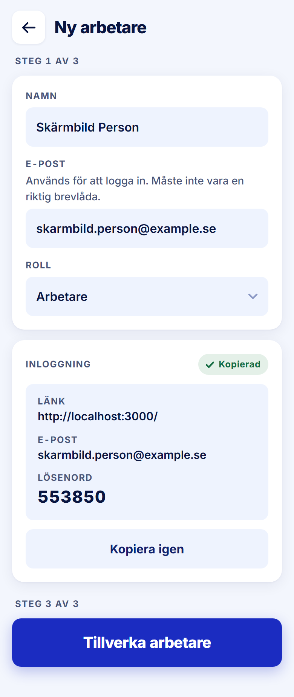

ROLE: admin

ENTRY: Filled Namn and E-post, pressed 'Kopiera inloggning'

SCREEN: Ny arbetare · inloggning kopierad

MISSION: Confirm the login was copied, then create the account.

FRICTION: none — restyle only

KEEP: Green 'Kopierad' tag, credential block with the password at 22/800, Kopiera igen, Tillverka arbetare enabled only now. (The link reads localhost because this was captured on the dev server.)

ADJUST: none — restyle only

