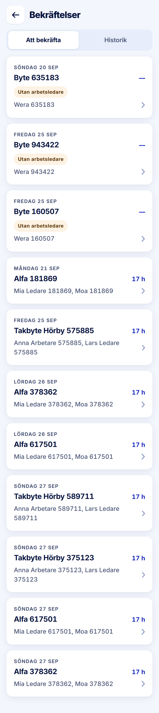

ROLE: admin

ENTRY: Pressed Meny → 'Bekräftelser'

SCREEN: Bekräftelser · Att bekräfta

MISSION: Work the stage-2 queue: open a day the leader confirmed, or a flagged day only admin can close.

FRICTION: A day with no hours shows '—' in accent blue at the row's right edge, where it reads as a minus/collapse control rather than 'no hours yet'.

KEEP: Day kicker, project, 'Utan arbetsledare' warn tag, names, chevron.

ADJUST: Visual weight: '—' in #4a5578, as the handoff does for '0 h'; accent stays for real hour figures.

