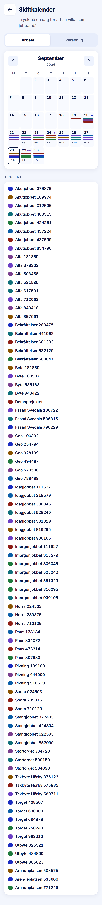

ROLE: admin

ENTRY: Pressed Meny → 'Kalender'

SCREEN: Skiftkalender (Arbete)

MISSION: See which sites run which days and open a day.

FRICTION: The PROJEKT legend lists every project in the company (113 here) including ones with no shift in the month shown, so it runs ~5000px and the colours that matter are lost among ones that do not appear on the grid.

KEEP: Fixed-palette colour bars, +N overflow as text, today ring, Arbete/Personlig switch.

ADJUST: Remove legend entries for projects with no shift in the displayed month.

