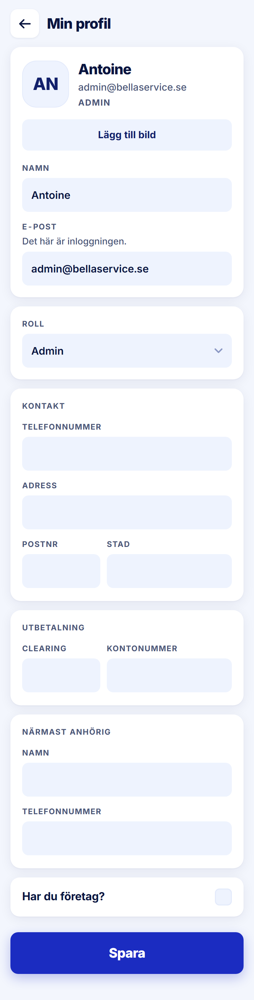

ROLE: admin

ENTRY: Pressed Profil → 'Min profil'

SCREEN: Min profil

MISSION: Keep own contact and payout details current.

FRICTION: Card titles stack on field labels in the same style.

KEEP: Identity card with avatar, grouped cards Kontakt / Utbetalning / Närmast anhörig, 60px company checkbox row, 64px Spara.

ADJUST: Card titles (e.g. "PROJEKTET", "KONTAKT") are set in the same 12/700 uppercase kicker as the field labels directly under them, so two labels stack and read as one. Set card titles at Title M (18/700, −0.4px, ink, sentence case) as the handoff's "titled cards" describe; field labels stay kickers.

