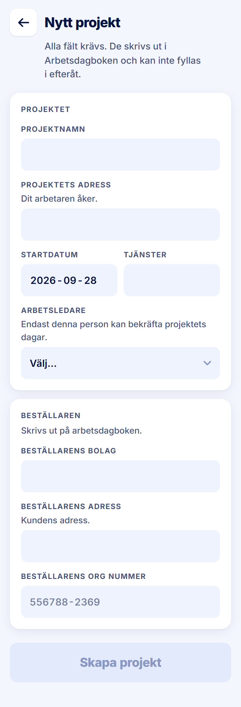

ROLE: admin

ENTRY: Pressed 'Nytt projekt' on Startsida

SCREEN: Nytt projekt

MISSION: Enter every field the Arbetsdagbok needs once, with the arbetsledare who will confirm the days (tour step 3, autofilled).

FRICTION: The card title 'PROJEKTET' sits directly above the field label 'PROJEKTNAMN' in the identical 12/700 uppercase style, so the card has no visible title — same for 'BESTÄLLAREN' / 'BESTÄLLARENS BOLAG'.

KEEP: Two cards split by what prints where, the subtitle 'Alla fält krävs…', help lines under address and beställare, disabled Skapa projekt until complete.

ADJUST: Card titles (e.g. "PROJEKTET", "KONTAKT") are set in the same 12/700 uppercase kicker as the field labels directly under them, so two labels stack and read as one. Set card titles at Title M (18/700, −0.4px, ink, sentence case) as the handoff's "titled cards" describe; field labels stay kickers.

