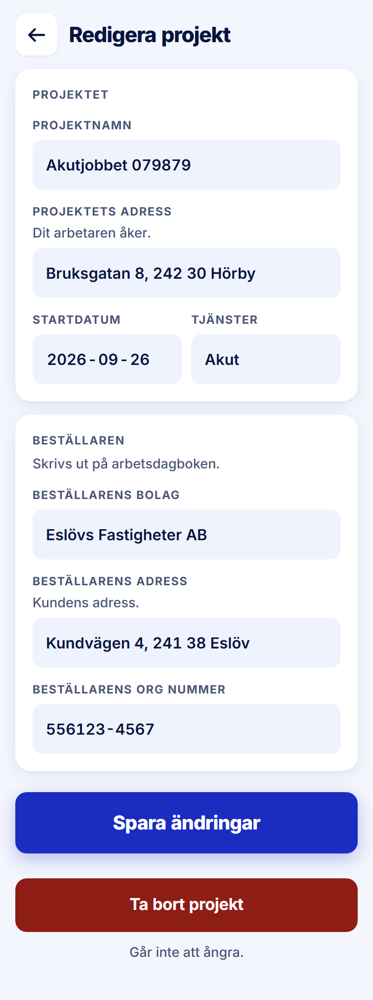

ROLE: admin

ENTRY: Pressed a project row, then 'Redigera Projekt'

SCREEN: Redigera projekt

MISSION: Correct a project's printed fields; rarely, delete it.

FRICTION: 'Ta bort projekt' is a solid #8e1d15 slab with white text, the same visual weight as 'Spara ändringar' directly above it. The handoff specifies a 56px #fbe9ec tint with #8e1d15 label: 'Deletion never gets the loudest button on the screen.' Card titles also stack on field labels as on Nytt projekt.

KEEP: Order (Spara first, deletion last and separated), 'Går inte att ångra.' under the delete button.

ADJUST: Ta bort projekt → 56px #fbe9ec fill, #8e1d15 label, as the day screen's 'Ta bort detta pass' already is. Plus: Card titles (e.g. "PROJEKTET", "KONTAKT") are set in the same 12/700 uppercase kicker as the field labels directly under them, so two labels stack and read as one. Set card titles at Title M (18/700, −0.4px, ink, sentence case) as the handoff's "titled cards" describe; field labels stay kickers.

