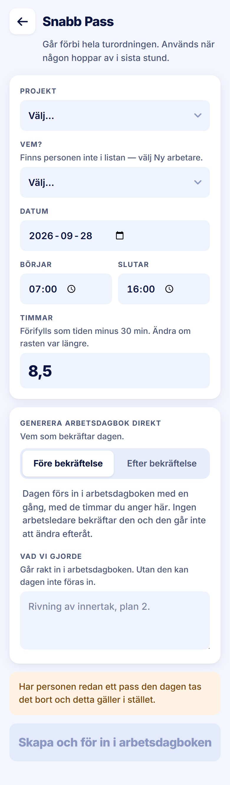

ROLE: admin

ENTRY: Pressed 'Snabb pass' on Startsida

SCREEN: Snabb Pass (Före bekräftelse, the mode it opens in)

MISSION: Put a named person on a day that someone dropped out of, and — in Före — file the day straight into the Arbetsdagbok with the hours agreed.

FRICTION: One choice has three names: kicker 'GENERERA ARBETSDAGBOK DIREKT', help 'Vem som bekräftar dagen.', options 'Före/Efter bekräftelse'. The amber notice says an existing shift that day 'tas bort', which no longer matches invariant 2 (a second, non-overlapping Snabb Pass is allowed).

KEEP: Timmar at 26/800 with the prefill explanation, the explanation line under the segmented control, the amber notice before the action, disabled primary until complete.

ADJUST: none — restyle only. The friction is not a layout change (the wording of the mode switch and of the amber notice are copy and product behaviour), so it is raised in the Phase 2 report for your decision rather than adjusted here.

NOTED (decided 2026-09-28, not fixed in this pass): Out of date. The amber notice says an existing shift that day is removed; invariant 2 now allows a second, non-overlapping Snabb Pass.
