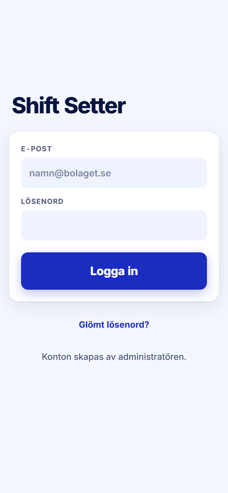

ROLE: alla (signed out — shared by all three roles)

ENTRY: Opened the app without a session (/ redirects to /login)

SCREEN: Logga in

MISSION: Get into the app with the e-post and lösenord the admin handed over.

FRICTION: none — restyle only

KEEP: Vertically centred card, 64px accent Logga in, 'Glömt lösenord?' link, the 'Konton skapas av administratören.' line that answers 'how do I sign up'.

ADJUST: none — restyle only

