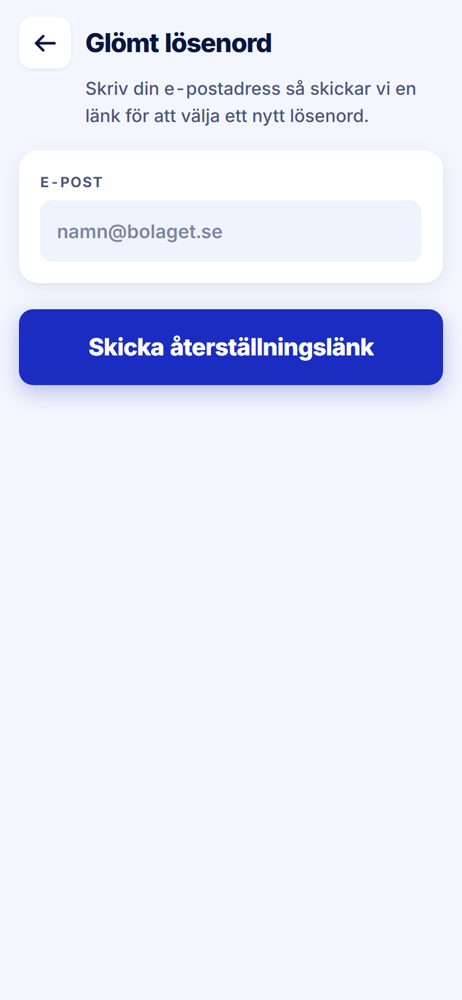

ROLE: alla (signed out)

ENTRY: Pressed 'Glömt lösenord?' on Logga in

SCREEN: Glömt lösenord

MISSION: Ask for a reset link to the e-post the account was created with.

FRICTION: none — restyle only

KEEP: One field, one primary action, subtitle that says what will happen.

ADJUST: none — restyle only

