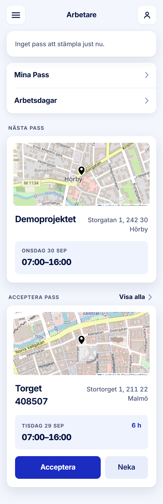

ROLE: arbetare

ENTRY: Logged in (lands on /)

SCREEN: Startsida

MISSION: Stamp in on the day, see the next shift, answer the next offer (tour: Arbetsdagar, Visa alla, Stämpla In).

FRICTION: none — restyle only

KEEP: Stamp card first, grouped Mina Pass / Arbetsdagar, Nästa pass with real map, one offer card with Acceptera (flex 2) and Neka (flex 1), 'Visa alla' as a word not a count.

ADJUST: none — restyle only

