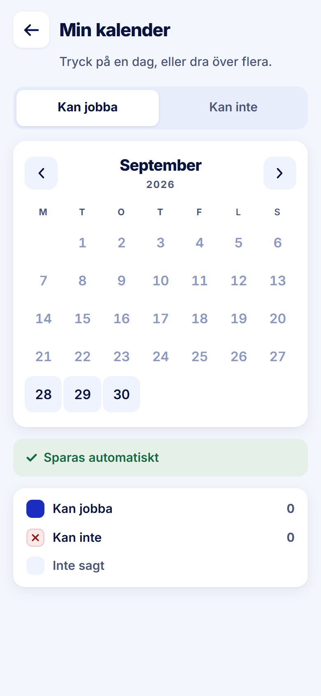

ROLE: arbetare

ENTRY: Pressed 'Arbetsdagar' on Startsida

SCREEN: Min kalender

MISSION: Book the days they can work (tour steps 1–3: 'Tryck på en dag du kan jobba. Den sparas direkt.').

FRICTION: none — restyle only

KEEP: One instruction line, mode switch, grid, 'Sparas automatiskt', legend — the tour's target is the grid and it is the biggest thing here.

ADJUST: none — restyle only

