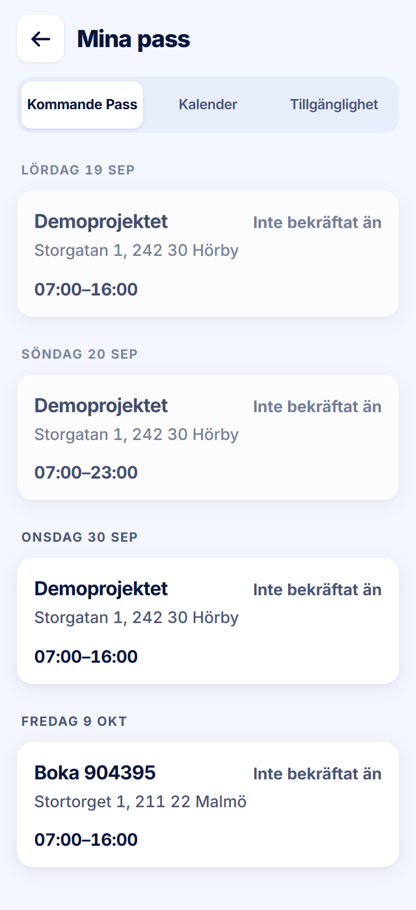

ROLE: arbetare

ENTRY: Pressed 'Mina Pass' on Startsida

SCREEN: Mina pass · Kommande Pass

MISSION: See the shifts they hold.

FRICTION: Past days (19–20 Sep) head a tab named 'Kommande Pass'.

KEEP: Dimmed past, 'Inte bekräftat än' (invariant 10: no hours until filed), segmented control.

ADJUST: none — restyle only. The friction is not a layout change (which days the tab includes, or its name, is content), so it is raised in the Phase 2 report for your decision rather than adjusted here.

NOTED (decided 2026-09-28, not fixed in this pass): Bug. Past days are listed first under Kommande Pass.
