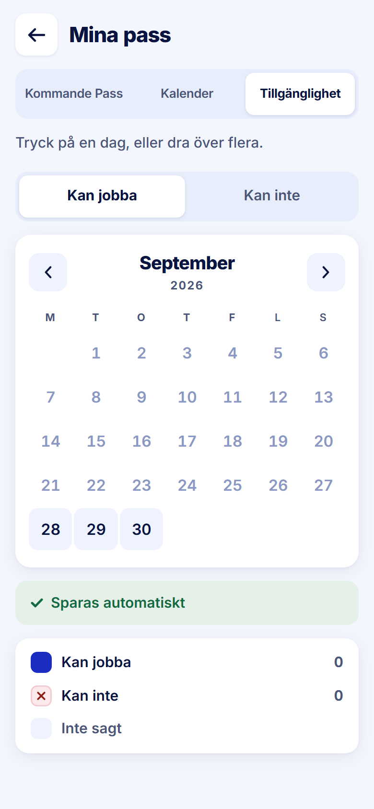

ROLE: arbetare

ENTRY: Pressed 'Tillgänglighet' on Mina pass

SCREEN: Mina pass · Tillgänglighet

MISSION: Mark the days they can work.

FRICTION: none — restyle only

KEEP: Mode switch, autosave strip, legend with counts.

ADJUST: none — restyle only

