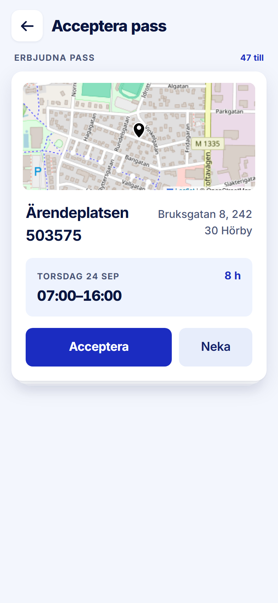

ROLE: arbetare

ENTRY: Pressed 'Visa alla' beside 'Acceptera pass' on Startsida

SCREEN: Acceptera pass

MISSION: Accept an offered shift (tour step 7: 'Tryck Acceptera på ett pass du vill ta').

FRICTION: The first card is Torsdag 24 Sep — four days in the past — while the home screen's card (which filters to today onward) showed Tisdag 29 Sep. The worker is asked to accept a day that has gone.

KEEP: The offer card as specified (map, site/address, time panel, 54px Acceptera/Neka), the '47 till' count, the stack edge.

ADJUST: none — restyle only. The friction is not a layout change (which offers are listed is a query, not layout — likely a bug), so it is raised in the Phase 2 report for your decision rather than adjusted here.

NOTED (decided 2026-09-28, not fixed in this pass): Bug. The list shows offers whose day has passed (24 Sep on 28 Sep); the home card filters to today onward.
