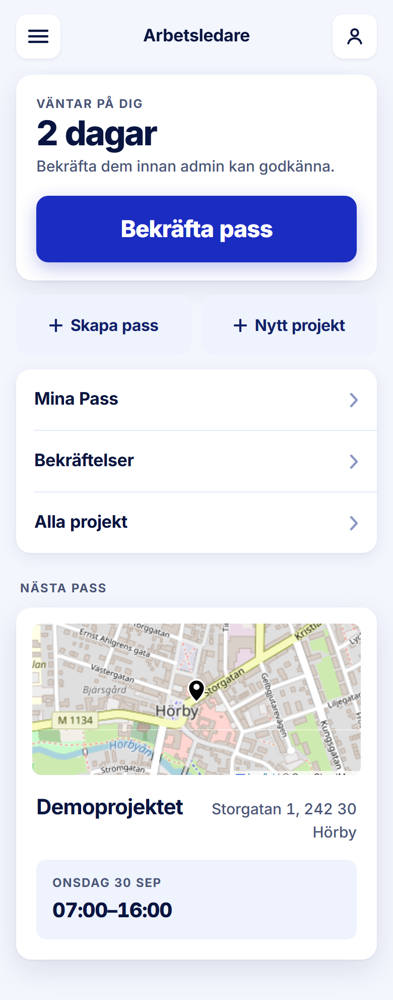

ROLE: arbetsledare

ENTRY: Logged in (lands on /)

SCREEN: Startsida

MISSION: See how many days are owed and confirm them; create shifts (tour: 'Tryck på Skapa pass', then 'Tryck på Bekräfta pass').

FRICTION: none — restyle only

KEEP: Hero count '2 dagar' with the 66px accent Bekräfta pass, the two pale creates side by side, grouped nav, Nästa pass with real map.

ADJUST: none — restyle only

