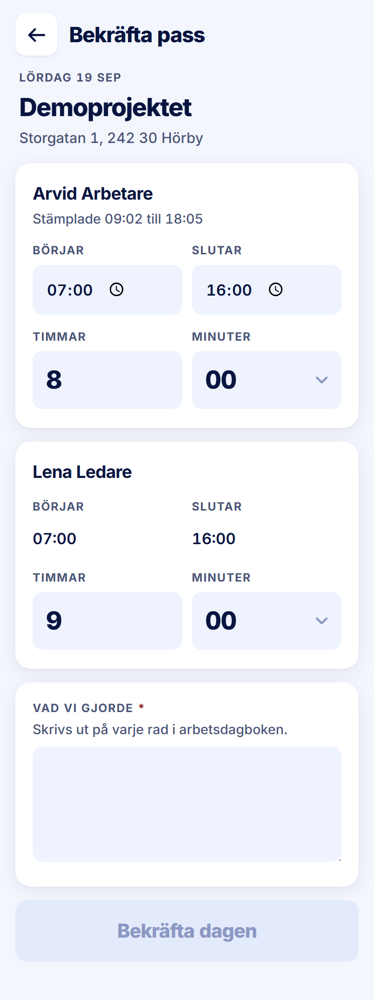

ROLE: arbetsledare

ENTRY: Pressed 'Bekräfta pass' on Startsida

SCREEN: Bekräfta pass (filled)

MISSION: State each person's hours and what was done, then confirm the day — final (tour step 8).

FRICTION: No finality notice before 'Bekräfta dagen' although confirming is irreversible (handoff §3.3 and the Bekräfta pass · ifylld spec both require it; the tour tip says it instead). The home said 2 days were waiting; this screen shows one with nothing saying another follows.

KEEP: Day kicker, project at 26/800, per-person cards, stamps as read-only context, the leader's own times read-only (invariant 1), Timmar big, Vad vi gjorde with the required marker, disabled primary until complete.

ADJUST: none — restyle only. The friction is not a layout change (the finality notice and a 'dag 1 av 2' cue are new text), so it is raised in the Phase 2 report for your decision rather than adjusted here.

NOTED (decided 2026-09-28, not fixed in this pass): Out of scope for this pass. No finality notice before Bekräfta dagen (handoff §3.3).
