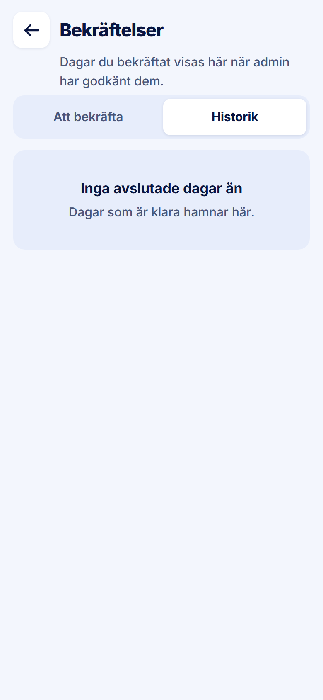

ROLE: arbetsledare

ENTRY: Pressed 'Historik' on Bekräftelser

SCREEN: Bekräftelser · Historik (empty)

MISSION: See days they confirmed that admin has approved.

FRICTION: The subtitle appears only on this tab, so the segmented control jumps ~86px down when switching tabs — the control moves out from under the finger that pressed it — and the subtitle sits flush on the control.

KEEP: Empty state headline + line.

ADJUST: Give the header the same height on both tabs (the subtitle slot is always present), with 14px between subtitle and control.

