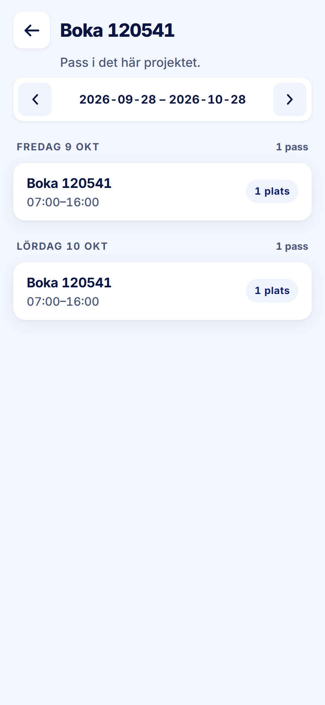

ROLE: arbetsledare

ENTRY: Pressed 'Kolla Pass' on an opened project card

SCREEN: Projektets pass

MISSION: See the project's coming shifts.

FRICTION: Every row repeats the project name that the screen title already shows, so the row's heading carries no information and the time is demoted to the secondary line.

KEEP: Period pager, day kicker with count, 'N plats' pill.

ADJUST: Remove the project name from the rows when the screen is scoped to one project; the time becomes the row's 16/700 heading.

