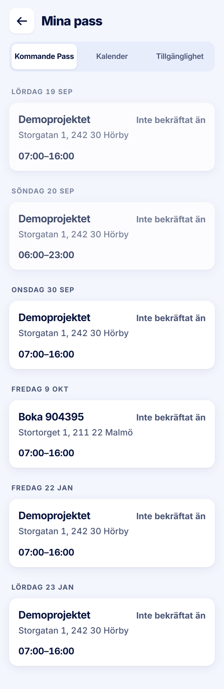

ROLE: arbetsledare

ENTRY: Pressed 'Mina Pass' on Startsida

SCREEN: Mina pass · Kommande Pass

MISSION: See the days they are placed on.

FRICTION: Under a tab named 'Kommande Pass' the first two cards are 19 and 20 Sep — past days, dimmed.

KEEP: Day kicker per card, 'Inte bekräftat än' state, dimming of the past, three-way segmented control.

ADJUST: none — restyle only. The friction is not a layout change (which days the tab includes, or its name, is content), so it is raised in the Phase 2 report for your decision rather than adjusted here.

NOTED (decided 2026-09-28, not fixed in this pass): Bug. Past days are listed first under Kommande Pass.
