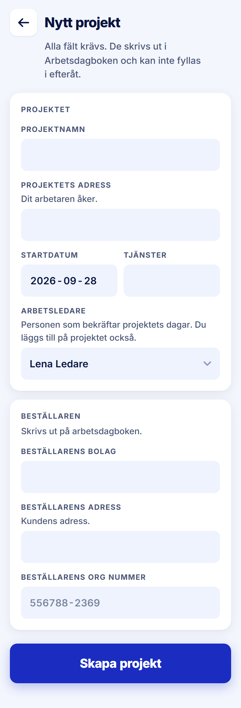

ROLE: arbetsledare

ENTRY: Pressed 'Nytt projekt' on Startsida

SCREEN: Nytt projekt

MISSION: Create a site and name the arbetsledare responsible (defaults to themselves).

FRICTION: Card titles stack on field labels in the same style.

KEEP: Same form as admin, with the leader-specific help 'Du läggs till på projektet också.'

ADJUST: Card titles (e.g. "PROJEKTET", "KONTAKT") are set in the same 12/700 uppercase kicker as the field labels directly under them, so two labels stack and read as one. Set card titles at Title M (18/700, −0.4px, ink, sentence case) as the handoff's "titled cards" describe; field labels stay kickers.

