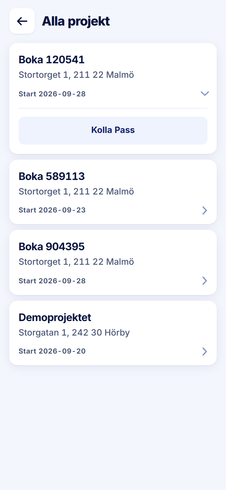

ROLE: arbetsledare

ENTRY: Pressed a project card on Alla projekt

SCREEN: Alla projekt · kort öppet

MISSION: Open the project's shifts.

FRICTION: The card expands to reveal one button, 'Kolla Pass' — two taps for the only thing the card offers this role.

KEEP: Same card anatomy as the admin's.

ADJUST: none — restyle only. The friction is not a layout change (making the card itself the link changes behaviour, not layout), so it is raised in the Phase 2 report for your decision rather than adjusted here.

