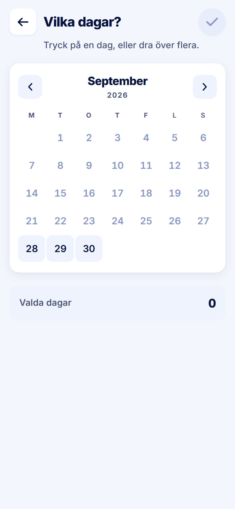

ROLE: arbetsledare

ENTRY: Pressed 'Skapa pass' on Startsida

SCREEN: Skapa pass · Vilka dagar?

MISSION: Paint the days for the new shifts (tour: 'Vi har valt en dag om två veckor. Tryck här för att gå vidare.').

FRICTION: As for admin: the way forward is an unlabelled 44px check icon in the top-right corner, grey until a day is picked and accent after, but never labelled, with the lower half of the screen empty.

KEEP: Month grid, drag-to-paint, Valda dagar count.

ADJUST: Move Fortsätt to a 64px primary directly under 'Valda dagar' (disabled at 0); remove the header check.

